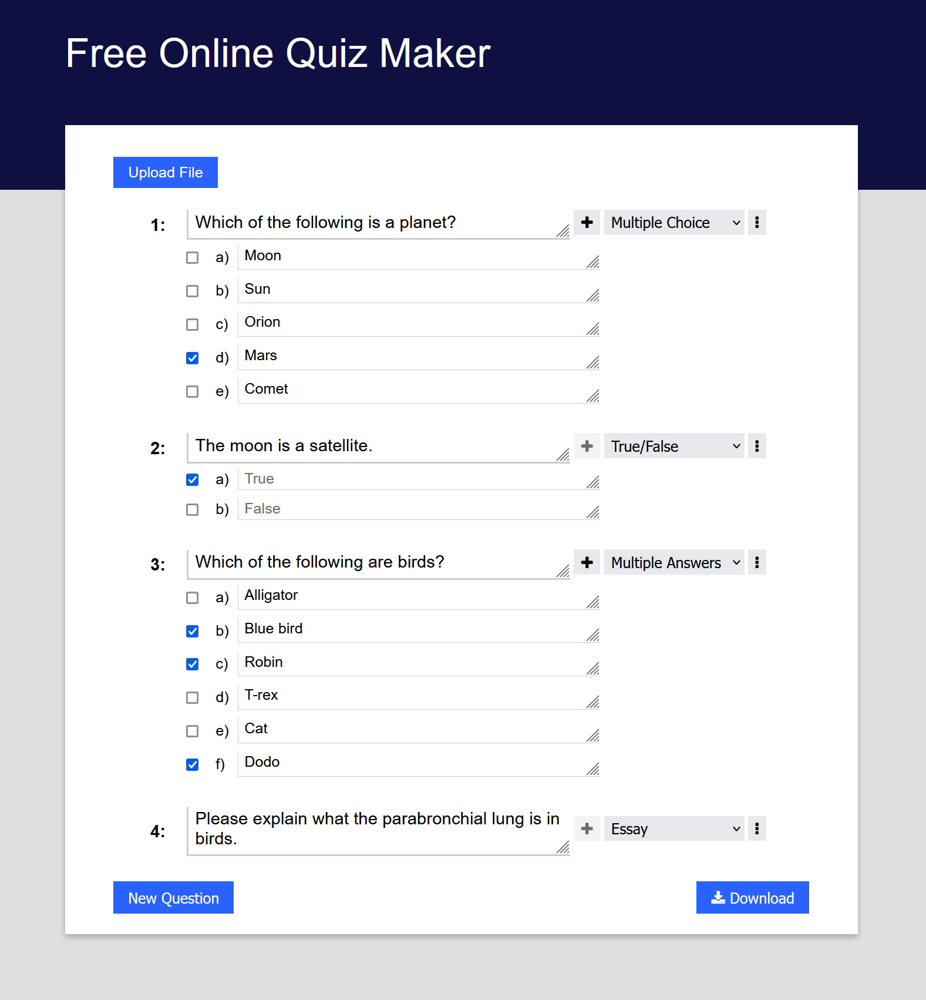

# Canvas Quiz Creator

## Description

Intuitive quiz maker that exports to a format that can be used with [San Diego University's Canvas Quiz Converter](http://ec2-34-207-154-191.compute-1.amazonaws.com/) application.

Create a quiz/test using this online application, click the download button to obtain a .txt file in the format required by the [San Diego University's Canvas Quiz Converter](http://ec2-34-207-154-191.compute-1.amazonaws.com/), and use it to create the .zip required by Canvas.

## How to Use

While the application will be put on my [portfolio site](https://www.braedenrichards.com) under _tools_ once completed, for now it must be run locally using the web server of your choice.

For example, if you have Python installed (and added to PATH if on Windows):
```
> python -m http.server
```

## Example of usage
